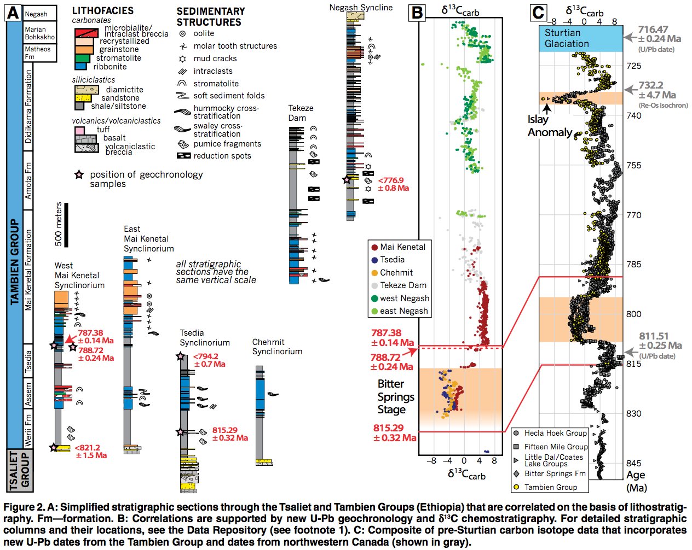

# Tonian carbon isotope composite

This repository contains a Jupyter notebook (developed using an Python 3 kernel) the develops the carbon isotope composite from ca. 850 to 720 Ma presented in Swanson-Hysell et al. (2015): 

Swanson-Hysell, N.L., Maloof, A.C., Condon, D.J., Jenkin, G.R.T., Alene, M., Tremblay, M.M., Tesema, T., Rooney, A.D. and Haileab, B. Stratigraphy and geochronology of the Tambien Group, Ethiopia: Evidence for globally synchronous carbon isotope change in the Neoproterozoic.  Geology, (2015), doi:10.1130/G36347.1.

<a href="http://escholarship.org/uc/item/0xw606vp">open access archive </a>| <a href="http://geology.gsapubs.org/content/early/2015/02/26/G36347.1.abstract">link to journal page</a> | <a title="Tambien Media Release Paragraph" href="http://www.swanson-hysell.org/publications/tambien-media-release-paragraph/">non-technical summary</a> 

In that manuscript, new carbon isotope data and U-Pb dates are presented from the Tambien Group of northern Ethiopia. These data are used to constrain a composite carbon isotope curve that also contains data from other basins which was presented in Fig 2c. Figure 2 of Swanson-Hysell et al. (2015) is reproduced below:

The Jupyter notebook that builds up this composite can be viewed as static html here:

https://github.com/Swanson-Hysell-Group/Tonian_Composite/blob/master/Tonian_Composite.ipynb

or here:

http://nbviewer.jupyter.org/github/Swanson-Hysell-Group/Tonian_Composite/blob/master/Tonian_Composite.ipynb
